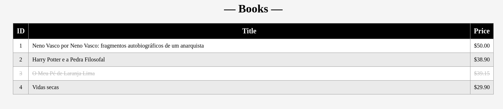

# Book API  — ver em [🇧🇷](README.md)

This repository implements an example of a Web API using the microframework [Flask](https://flask.palletsprojects.com/) to manage the [CRUD](https://en.wikipedia.org/wiki/Create,_read,_update_and_delete) operations for a bookstore system. The service uses an [SQLite](https://www.sqlite.org/) database, which is built from the mapping of the [Book](#object) class via [Flask-SQLAlchemy](https://flask-sqlalchemy.readthedocs.io/en/stable/). The database is created on the first execution of the server.

*Note: This is a project created for learning purposes*

## How to run BookAPI

To run **BookAPI**, it is recommended that you first create a virtual environment ([*virtualenv*](https://virtualenv.pypa.io/en/latest/user_guide.html)) so that the libraries used in this example do not interfere with your system's default libraries.

### Setting up a virtual environment (*virtualenv*)

1) First, install the `virtualenv` tool via `pip`:
```bash
pip install virtualenv
```

2) After installation, create your virtual environment in this repository's directory. Here, the chosen name is `.venv`:
```bash
virtualenv .venv
```

3) To activate the virtual environment, use one of the following commands:

```bash
# Linux / macOS
source .venv/bin/activate

# Windows
...
.\.venv\Scripts\activate
```

- *Note: This step must be repeated every time you want to use the environment created for this repository.*

4) To ensure the environment is activated, check if the command line prompt includes `(.venv)`, as in the example:

```bash
(.venv) user@linux:~/BookAPI$
```

### Installing dependencies via *pip*

Install the necessary libraries to run **BookAPI** using the command below. If you are using a [virtual environment](#setting-up-a-virtual-environment-virtualenv), make sure that `(.venv)` appears in the command line prompt.

```bash
pip install -r requirements.txt
```

### Running

The following command starts the server in *debugging mode*. If you are using a [virtual environment](#setting-up-a-virtual-environment-virtualenv), ensure that `(.venv)` appears in the command line prompt.

```bash
flask run --debug
```

An HTTP service will be started on port 5000. Access the URL `http://127.0.0.1:5000` in your browser.

## API Documentation

### Object

The [Book](app.py) class in Python and its JSON representation:

```python
class Book(db.Model):
    __tablename__ = 'books'
    id = db.Column(db.Integer, primary_key=True)
    title = db.Column(db.String(256), nullable=False)
    price = db.Column(db.Float, nullable=False)
    soldout = db.Column(db.Boolean, nullable=False)
    ...
```

```JSON
{
    "id": 1,                       // integer
    "title": "A book title",      // string
    "price": 19.99,                // float
    "soldout": false               // boolean
}
```

### Routes

#### Index

Returns an HTML page with book visualization functionalities.

```plain
Route: /
Method: GET
Input: None
Output: HTML
```

* Output:



#### Get Books

Returns a JSON Array containing all books stored in the database.

```plain
Route: /get-books
Method: GET
Input: None
Output: JSON Array
```

* Example output:
```json
[
    {
        "id": 1,
        "price": 50.0,
        "soldout": false,
        "title": "Neno Vasco by Neno Vasco: autobiographical fragments of an anarchist"
    },
    {
        "id": 2,
        "price": 38.9,
        "soldout": false,
        "title": "Harry Potter and the Sorcerer's Stone"
    },
    {
        "id": 3,
        "price": 39.15,
        "soldout": true,
        "title": "My Sweet Orange Tree"
    },
    {
        "id": 4,
        "price": 29.9,
        "soldout": false,
        "title": "Barren Lives"
    }
]
```

#### Insert Books

Provides a method to insert new books into the database.

```plain
Route: /new-book
Method: POST
Input: JSON
Output: Status 200
```

* Example input:
```json
{
    "title": "Barren Lives",
    "price": 29.9
}
```

#### Delete Books

Provides a method to remove books from the database.

```plain
Route: /del-book/<id>
Method: DELETE
Input: <id>
Output: Status 200
Error: Status 204 if book not found
```

* Example input: `http://127.0.0.1:5000/del-book/2`

#### Update Book

Provides a method to update all details of a specific book in the database.
 - Returns JSON of the updated book.
 - Returns 204 if the book is not found.

```plain
Route: /update-book/<id>
Method: PUT
Input: JSON
Output: JSON
Error: Status 204 if book not found
```

* Example input:

```json
{
    "title": "new title",  // optional
    "price": 34.0,         // optional
    "soldout": true        // optional
}
```

*Note: The input parameters are optional, meaning there is no need to include all of them in a single update request.*

#### Update Status

Updates the "sold out" (*soldout*) status in the database.
 - Returns JSON of the updated book.
 - Returns 204 if the book is not found.

```plain
Route: /update-book/<id>/soldout/<boolval>
Method: PUT
Input: <id> & <boolval>
Output: Status 200
```

* Example input: `http://127.0.0.1:5000/update-book/1/soldout/1`

*Note: **boolval** must be 1 (true) or 0 (false)*

<hr>

Author: [Vinícius F. Maciel](https://www.viniciusfm.pro.br)

